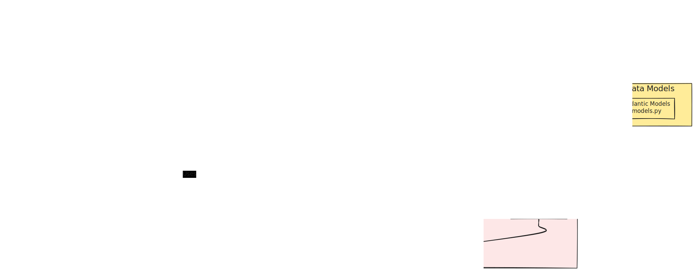

# Resume Insights



Resume Insights is an advanced resume parsing and analysis tool that leverages the power of LlamaIndex, Gemini, and Streamlit to extract key information from PDF resumes and present it in an intuitive, interactive format. The application provides detailed skill analysis, work history extraction, and job matching capabilities with a comprehensive observability layer for monitoring and debugging.

## 🌟 Features

- **PDF Resume Parsing**: Seamlessly extract information from PDF resumes using LlamaParse.
- **AI-Powered Analysis**: Utilizes Gemini LLM for intelligent information extraction and skill matching.
- **Interactive UI**: Built with Streamlit for a user-friendly experience.
- **Enhanced Skill Analysis**: Categorizes skills, estimates proficiency levels, calculates years of experience, and identifies related skills.
- **Work History Analysis**: Extracts and analyzes work experience to determine skill proficiency and duration.
- **Job Matching**: Analyzes skill relevance for specific job positions with detailed reasoning.
- **Structured Output**: Extracts name, email, age, and skills in a structured format using Pydantic models.
- **Comprehensive Observability**: Includes structured logging and metrics collection for monitoring application performance.

## 🚀 Quick Start

1. Clone the repository:

   ```
   git clone https://github.com/luillyfe/resume-insights.git
   cd resume-insights
   ```

2. Install dependencies:

   ```
   pip install -r requirements.txt
   ```

3. Set up environment variables:

   ```
   export GOOGLE_API_KEY=your_google_api_key
   export LLAMA_CLOUD_API_KEY=your_llama_cloud_api_key
   ```

4. Run the Streamlit app:

   ```
   streamlit run app.py
   ```

5. Open your browser and navigate to `http://localhost:8501`.

## 🛠️ Tech Stack

- **LlamaIndex**: For document processing, indexing, and querying.
- **Gemini**: AI model for natural language understanding and generation.
- **Streamlit**: For building the interactive web application.
- **Pydantic**: For data validation and settings management.
- **LlamaParse**: For efficient PDF parsing.
- **Structured Logging**: JSON-formatted logging for better observability.
- **Metrics Collection**: Performance tracking with timing decorators and counters.
- **Modular Architecture**: Factory pattern and dependency injection for better testability.


## 📊 How It Works

1. **Document Processing**: Resumes are parsed using LlamaParse and split into manageable chunks.
2. **Indexing**: Processed documents are indexed using LlamaIndex's VectorStoreIndex.
3. **Information Extraction**: The system extracts key information like name, email, age, and skills.
4. **Work History Analysis**: Work experience is analyzed to determine career progression and skill development.
5. **Enhanced Skill Analysis**: Skills are categorized, proficiency levels are estimated based on experience, and related skills are identified.
6. **Job Matching**: Skills are analyzed for relevance to specific job positions with detailed reasoning for each skill's importance.
7. **Observability**: Structured logging and metrics collection track application performance and help identify bottlenecks.
8. **Interactive UI**: Users can explore extracted information and job matching results through a Streamlit interface.

## 🧠 Key Components

- `ResumeInsights`: Main class for processing resumes and extracting information.
- `SkillAnalyzer`: Analyzes and categorizes skills with detailed proficiency estimation.
- `WorkHistoryAnalyzer`: Extracts and analyzes work experience entries.
- `JobMatcher`: Matches candidate skills to job requirements with relevance reasoning.
- `Candidate` & `SkillDetail`: Pydantic models for structured candidate and skill data.
- `JobSkill`: Pydantic model for skill relevance to job positions.
- `Logger` & `MetricsCollector`: Observability components for monitoring and debugging.
- `QueryEngineFactory`: Factory class for creating query engines from different file types.
- Streamlit app: Provides the user interface for uploading resumes and displaying insights.

## ⚠️ Limitations

- The free tier of the Gemini API/Google Cloud has a 10k byte limit on request payloads, which may limit the number of skills that can be processed: [issue](https://discuss.ai.google.dev/t/payload-size-limit-error-with-embed-content-api/44342).
- LlamaIndex may face challenges with knowledge dispersed across different sections of a document, such as inferring age or skill proficiency from work experience.

## 🤝 Contributing

Contributions are welcome! Please feel free to submit a Pull Request.

## 📝 License

This project is licensed under the MIT License - see the [LICENSE](LICENSE) file for details.

## 📬 Contact

For any queries or suggestions, please open an issue or contact [luillyfe89@gmail.com](mailto:luillyfe89@gmail.com).

---

Made with ❤️ by [Fermin Blanco](https://luillyfe.medium.com/)
